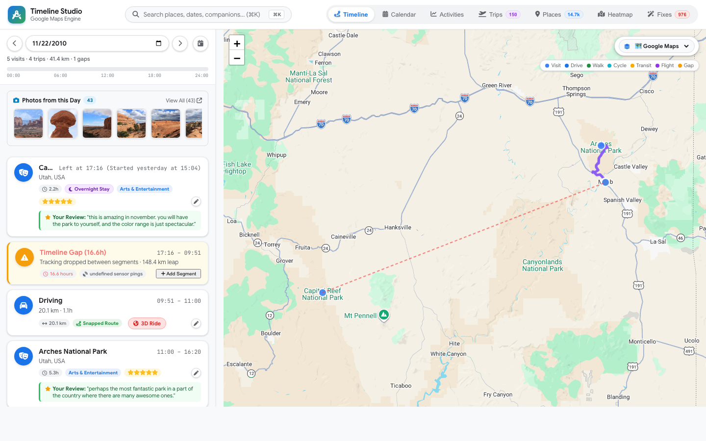
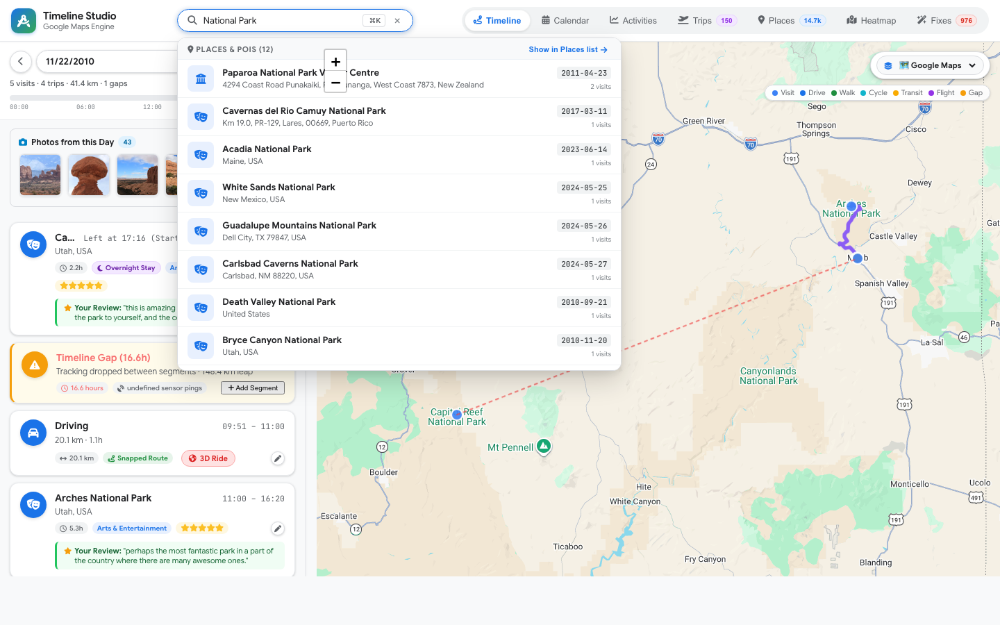
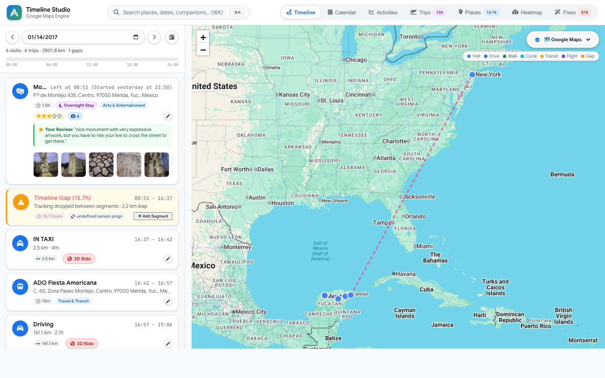

# MyLifeBits

Personal location history viewer, Google Takeout ingestion engine, and life archive backed by a local SQLite database.



## Quickstart

```bash
# 1. Install dependencies
uv sync

# 2. Seed database with anonymized demo timeline
uv run python scripts/init_db.py --demo

# 3. Start web studio
uv run python server.py
```

Access the UI at `https://mylifebits.local` (or configure your local reverse proxy to forward to the server).

## Takeout Ingestion

Ingest location history, photos, reviews, saved places, and vector embeddings with `importer.py`. The importer accepts ZIP archives, extracted directory trees, or individual JSON/GeoJSON files:

### Location History
```bash
# Takeout ZIP archive or extracted folder
uv run python importer.py /path/to/takeout.zip
uv run python importer.py /path/to/Takeout/"Location History (Timeline)"/

# Modern on-device Timeline export (Android / iOS)
uv run python importer.py /path/to/Timeline.json

# GeoJSON export
uv run python importer.py /path/to/Location\ History.json
```

### Google Photos & Media
```bash
# Streaming ZIP ingestion (no disk extraction required)
uv run python importer.py --photos /path/to/photos-takeout.zip

# Extracted Google Photos folder
uv run python importer.py --photos /path/to/Takeout/"Google Photos"/
```
Extracts timestamps, GPS, and faces from companion `.json` sidecars or EXIF, generates WebP previews in `data/previews/`, and links photos to matching timeline visits and places.

### Google Maps Reviews & Saved Places
```bash
# Contributor reviews (ratings, text, photos)
uv run python importer.py --reviews /path/to/Reviews.json

# Saved places (Want to go, Starred, Favorites)
uv run python importer.py --saved /path/to/"Saved Places.json"
```

### Visual Vector Embeddings & Universal Search
Photos and visits are indexed with 512-dimensional vector embeddings (`open_clip:ViT-B-32`):
```bash
# Import precomputed embeddings from an existing photo vault (e.g., photos_vault.db)
uv run python importer.py --embeddings /path/to/photos_vault.db
```
The search engine (`api/photo_search.py`) queries the local `photo_embeddings` table via vector dot products, falls back to a remote search endpoint (`PHOTOS_SEARCH_URL` / `https://photos.local/api/search`), and falls back to local OCR/metadata search (`ocr_text`, `people`, `place_name`).



### Flight Paths & Road Snapping
Multi-modal trips connect street-snapped driving routes, transit legs, and flight paths with contributor reviews:



## CLI Options

```bash
uv run python importer.py [paths...] [flags]
```

| Flag | Description |
| :--- | :--- |
| `--photos` | Treat input as Google Photos Takeout (ZIP or directory) |
| `--reviews` | Treat input as Google Maps Reviews (JSON or GeoJSON) |
| `--saved` | Treat input as Google Maps Saved Places JSON |
| `--embeddings` | Import precomputed visual embeddings and OCR from a SQLite vault |
| `--include-records` | Stream raw GPS fixes from `Records.json` |
| `--stride N` | Sampling stride for raw GPS fixes (default: `1`) |
| `--db PATH` | Target database path (default: `timeline.db` or `$TIMELINE_DB_PATH`) |

## Architecture & Schemas

See [docs/ARCHITECTURE.md](docs/ARCHITECTURE.md) for full schema definitions, protobuf reverse engineering, and REST API specifications.

### Core Tables

| Table | Purpose |
| :--- | :--- |
| `segments` | Continuous visits (`segment_type=1`) and travel legs (`segment_type=2`) |
| `places` | Canonical POI catalog with coordinates, categories, and Google Place IDs (`ChIJ...`) |
| `days` | Aggregated daily metrics (date, distance, timezone, segment counts) |
| `breadcrumbs` | Raw sensor telemetry (GPS fixes, timestamps, accuracy) |
| `photos` | Photo metadata (SHA-256, timestamps, coordinates, place links, blur score, OCR text) |
| `photo_embeddings` | 512-dim normalized float32 visual embeddings (`open_clip:ViT-B-32`) |
| `poi_reviews` | Google Maps contributor reviews linked to visited venues |
| `custom_labeled_places` | Starred, Want to go, and custom-labeled places |

## Configuration

Settings are configured via environment variables or a `.env` file:

| Variable | Default | Purpose |
| :--- | :--- | :--- |
| `TIMELINE_DB_PATH` | `timeline.db` | SQLite database file |
| `PORT` | `8000` | Web server port |
| `PHOTOS_ENABLED` | `false` | Enable photo evidence in timeline UI |
| `PREVIEWS_DIR` | `data/previews` | Generated WebP thumbnails directory |
| `PHOTOS_SEARCH_URL` | `https://photos.local/api/search` | Fallback vector search endpoint |

## Testing

```bash
uv run python -m unittest tests/test_clean_api.py tests/test_e2e_server.py tests/test_takeout_importer.py
uv run python scripts/audit_api_contracts.py
```

## License

[MIT](LICENSE)

---

*Named in homage to Gordon Bell and Jim Gemmell's pioneering MyLifeBits lifelogging research at Microsoft Research.*
