# MyLifeBits Architecture & Implementation Specification

This document provides a comprehensive technical reference for the **MyLifeBits / Timeline Studio** platform. It details the system architecture, database schema, multi-format Google Takeout ingestion pipelines, spatial-temporal data invariants, place resolution algorithms, and REST API contracts.

It is designed to serve both as the blueprint for this codebase and as an interoperability guide for developers building alternative implementations in other environments (e.g. Go, Rust, TypeScript, or Swift).

---

## 1. System Vision & Architecture Overview

### 1.1 Core Mission
Google Maps Timeline shifted from cloud storage to local-only on-device storage in 2024–2025. This migration resulted in widespread data fragmentation:
- Cloud Takeouts prior to November 2024 preserved rich human-readable place names, addresses, and full-resolution road paths, but cut off at the migration date.
- Modern on-device mobile exports preserve recent history up to the present day, but frequently prune place names (`UNKNOWN`), truncate road polylines into straight-line chords, and restrict raw sensor data to a 30-day buffer.
- Device replacements or app resets risk complete data loss.

**MyLifeBits** solves this by establishing a permanent, privacy-first, local-first location intelligence spine. It unifies decades of historical Takeout archives, modern on-device exports, photo EXIF coordinates, and geocoded records into a single high-fidelity chronological dataset.

### 1.2 Architectural Block Diagram

```mermaid
flowchart TD
    subgraph Ingestion ["1. Multi-Format Ingestion Layer"]
        T1["Classic Takeout ZIP (Semantic JSON)"]
        T2["Modern On-Device Export (Timeline.json)"]
        T3["Takeout GeoJSON FeatureCollections"]
        T4["Raw Sensor Dumps (Records.json)"]
        T5["Contributor Reviews & Photos"]
    end

    subgraph Processing ["2. Normalization & Repair Engine"]
        P1["Format Auto-Detection (importer.py)"]
        P2["Temporal Monotonicity & Midnight Stay Slicing"]
        P3["Road Snapper (OSRM / OpenStreetMap)"]
        P4["Place Deduplication & Canonical Aliasing"]
        P5["Companion & Attendee Resolution"]
    end

    subgraph Storage ["3. Local Storage Layer (SQLite WAL)"]
        DB[("timeline.db / timeline_viewer.db")]
        T_SEG["segments (Visits & Activities)"]
        T_PLC["places (Canonical POI Catalog)"]
        T_TRP["trips (Expedition Clusters)"]
        T_BC["breadcrumbs (Sensor Samples)"]
        T_LP["life_periods (Temporal Bases)"]
    end

    subgraph API ["4. API & Service Layer (server.py)"]
        R_TIME["/api/day & /api/calendar"]
        R_PLC["/api/places & /api/search"]
        R_TRP["/api/trips & /api/flythrough"]
        R_FIX["/api/fixes & /api/segments"]
        R_PHO["/api/photos & Proxy Cache"]
    end

    subgraph Frontend ["5. Web Studio & Phone Emulator UI"]
        UI_WEB["Studio Dashboard (Voyager Map & Metrics)"]
        UI_MOB["Mobile Emulator (Simulated Native Timeline)"]
    end

    Ingestion --> Processing
    Processing --> Storage
    Storage --> API
    API --> Frontend
```



---

## 2. Data Model & Database Schema

The core datastore is a SQLite 3 database operating in Write-Ahead Logging (`PRAGMA journal_mode = WAL`) mode with `NORMAL` synchronous commits. This provides concurrent read throughput while supporting atomic transactions.

### 2.1 The `segments` Table (Primary Timeline Spine)
Every continuous period of time in a user's life is categorized as either a **Visit** (`segment_type = 'visit'`) or a **Movement Activity** (`segment_type = 'activity'`).

```sql
CREATE TABLE IF NOT EXISTS segments (
    id INTEGER PRIMARY KEY AUTOINCREMENT,
    segment_type TEXT NOT NULL,          -- 'visit' | 'activity'
    start_time TEXT NOT NULL,            -- Local ISO 8601 string (e.g. '2024-05-01T12:00:00-04:00')
    end_time TEXT NOT NULL,              -- Local ISO 8601 string
    start_ts REAL NOT NULL,              -- UTC Unix epoch timestamp (seconds)
    end_ts REAL NOT NULL,                -- UTC Unix epoch timestamp (seconds)
    duration_minutes REAL NOT NULL,      -- Elapsed duration in minutes
    date TEXT NOT NULL,                  -- Local calendar date 'YYYY-MM-DD'
    year INTEGER NOT NULL,               -- Integer year (for partition filtering)
    month INTEGER NOT NULL,              -- Integer month (1-12)
    day INTEGER NOT NULL,                -- Integer day of month (1-31)
    latitude REAL,                       -- Visit latitude or activity start latitude
    longitude REAL,                      -- Visit longitude or activity start longitude
    end_lat REAL,                        -- Activity destination latitude (NULL for visits)
    end_lng REAL,                        -- Activity destination longitude (NULL for visits)
    place_id TEXT,                       -- Canonical Google Maps Place ID (e.g. 'ChIJ...')
    place_name TEXT,                     -- Synthesized human-readable place name
    place_address TEXT,                  -- Street address or vicinity string
    semantic_type TEXT,                  -- 'TYPE_HOME', 'TYPE_WORK', 'CAFE', 'UNKNOWN'
    category TEXT,                       -- Canonical taxonomy category
    city TEXT,                           -- Resolved municipality
    activity_type TEXT,                  -- 'WALKING', 'CYCLING', 'DRIVING', 'IN_SUBWAY', 'FLYING'
    distance_meters REAL DEFAULT 0.0,    -- Ground distance in meters
    clean_distance_meters REAL,          -- Snapped road curve distance in meters
    probability REAL DEFAULT 1.0,        -- Confidence score (0.0 - 1.0)
    hierarchy_level INTEGER DEFAULT 0,   -- 0 = primary segment, 1 = enclosed child visit
    parent_segment_id INTEGER,           -- ID of enclosing visit if hierarchy_level = 1
    path_points_json TEXT,               -- GeoJSON coordinates array: [[lat, lng], ...]
    has_snapped_path INTEGER DEFAULT 0,  -- 1 if path_points_json contains street-snapped curve
    is_unconfirmed INTEGER DEFAULT 0,    -- 1 if venue or activity type is ambiguous
    review_rating INTEGER,               -- Contributor review rating (1-5) if reviewed
    review_photos TEXT,                  -- JSON array of photo URLs
    source TEXT,                         -- Provenance tag ('TAKEOUT_CLOUD', 'ON_DEVICE', 'GEOJSON')
    FOREIGN KEY (place_id) REFERENCES places(place_id),
    FOREIGN KEY (parent_segment_id) REFERENCES segments(id)
);
```

### 2.2 The `places` Table (Canonical POI Catalog)
Deduplicates all physical venues visited across the user's lifetime, maintaining cumulative statistics and metadata.

```sql
CREATE TABLE IF NOT EXISTS places (
    place_id TEXT PRIMARY KEY,           -- Canonical Place ID (e.g. 'ChIJ4fiiy-Dan5gRwUq5Tk232Yg')
    name TEXT,                           -- Venue name
    address TEXT,                        -- Formatted address
    semantic_type TEXT,                  -- Semantic tag ('TYPE_HOME', 'TYPE_WORK', etc.)
    category TEXT DEFAULT 'Other / POI', -- Broad taxonomy category
    city TEXT,                           -- City name
    country TEXT,                        -- Country name
    user_confirmed INTEGER DEFAULT 0,    -- 1 if explicitly confirmed by user
    latitude REAL,                       -- Venue coordinate
    longitude REAL,                      -- Venue coordinate
    visit_count INTEGER DEFAULT 0,       -- Cumulative visits across entire life
    first_visit_time TEXT,               -- Earliest recorded presence
    last_visit_time TEXT,                -- Most recent recorded presence
    source TEXT                          -- Originating archive source
);
```

### 2.3 Additional Core Tables
- **`trips`**: Multi-day journeys away from home bases with destination labels, start/end dates, total distances, and top destinations.
- **`breadcrumbs`**: High-frequency raw sensor fixes (`lat`, `lng`, `accuracy`, `timestamp`, `is_excluded`).
- **`life_periods`**: Chronological residency and career eras with temporal validity (`start_date`, `end_date`, `lat`, `lng`).
- **`photos`**: Photo indexing table linking image SHA256 hashes, timestamps, locations, and detected people.
- **`poi_reviews`**: User's Google Maps contributor reviews with ratings, review text, and photo URLs.
- **`place_aliases`**: Aliasing table mapping mutated or deprecated Place IDs to canonical Place IDs.

---

## 3. Multi-Format Ingestion Specifications

The platform provides a universal importer (`importer.py`) capable of ingesting all known variations of Google Takeout and mobile exports.

### 3.1 Format 1: Classic Semantic Takeout (Pre-2024 Cloud Archives)
- **File Structure**: `Takeout/Location History/Semantic Location History/YYYY/YYYY_MONTH.json`
- **Root Key**: `timelineObjects: [...]`
- **Entities**:
  - `placeVisit`: Contains `location.placeId`, `location.name`, `location.address`, `location.latitudeE7`, `location.longitudeE7`, `duration.startTimestamp`, `duration.endTimestamp`, `editConfirmationStatus`.
  - `activitySegment`: Contains `duration`, `activityType`, `distance` (meters), `startLocation.latitudeE7`, `endLocation.latitudeE7`, and `waypointPath.waypoints` or `simplifiedRawPath.points`.
- **Parsing Rule**: Multiply `E7` coordinates by `1e-7` ($coord = \frac{coord_{E7}}{10,000,000}$).

### 3.2 Format 2: Modern On-Device Takeout Export (Post-2024 Exports)
- **File Structure**: `Timeline.json` or `Timeline-*.json`
- **Root Key**: `semanticSegments: [...]`
- **Entities**:
  - `visit`: Contains `topCandidate.placeId`, `topCandidate.placeLocation.latLng` (string formatted as `"40.7271°, -73.9774°"`), `hierarchyLevel` (0 for primary stay, 1 for nested venue visit), and `startTime` / `endTime` ISO 8601 strings.
  - `activity`: Contains `topCandidate.type`, `distanceMeters`, `start.latLng`, `end.latLng`, `timelinePath`.
  - `rawSignals`: Rolling 30-day buffer of Wi-Fi scans, cell fixes, and sensor positions.

### 3.3 Format 3: Google Takeout GeoJSON
- **File Structure**: `Location History (Timeline).json` or `records.geojson`
- **Root Key**: `{"type": "FeatureCollection", "features": [...]}`
- **Entities**:
  - Points represent visits with properties `placeId`, `name`, `address`, `startTime`, `endTime`.
  - LineStrings represent activities with properties `activityType`, `distance`, `startTime`, `endTime`, and coordinates arrays `[[lng, lat], ...]`.

### 3.4 Format 4: Raw Sensor Records
- **File Structure**: `Records.json` or `Location History.json`
- **Root Key**: `locations: [...]`
- **Fields**: `timestamp` (or `timestampMs`), `latitudeE7`, `longitudeE7`, `accuracy`, `velocity`, `altitude`.

---

## 4. Spatio-Temporal Invariants & Physics Engine

To ensure mathematical and physical validity, candidate timeline data must adhere to strict invariant constraints:

### 4.1 Temporal Monotonicity
No timeline segment may overlap with another. Segments must be ordered such that:
$$t_{\text{start}, i} \ge t_{\text{end}, i-1}$$

When a gap occurs ($t_{\text{start}, i} > t_{\text{end}, i-1}$):
- Intervals $<15\text{ minutes}$ with spatial proximity $<100\text{ m}$ between adjacent points may be seamlessly closed by extending adjacent visit boundaries.
- Intervals $\ge 15\text{ minutes}$ with spatial separation are classified as legitimate unrecorded gaps or inferred movement activities.

### 4.2 Midnight Stay Integrity
Traditional parsers split overnight visits into two artificial pieces: one ending at `23:59:59` and a new one starting at `00:00:00`.
**Rule**: An overnight stay spanning across midnight must remain a **single contiguous visit entity** in the database. Day slicing for UI calendar views is performed dynamically at query-time using date boundary overlaps:
$$\text{segment.start\_date} \le \text{target\_date} \le \text{segment.end\_date}$$

### 4.3 Physical Velocity Bounds & Flight Validation
Movement types must satisfy real-world kinematic constraints:
- `WALKING`: Average velocity $v \le 12\text{ km/h}$.
- `CYCLING`: Average velocity $v \le 45\text{ km/h}$.
- `DRIVING` / `IN_PASSENGER_VEHICLE`: Realistic road speeds ($v \le 160\text{ km/h}$).
- `FLYING`: Strictly bounded by three mandatory physical factors:
  1. Straight-line distance $d > 300\text{ km}$.
  2. Average speed $v > 250\text{ km/h}$.
  3. Spatial proximity to verified airport POIs ($\le 5\text{ km}$) at both origin and destination endpoints. Ground transitions below $300\text{ km}$ must default to ground transit.

### 4.4 Street Snapping & Polyline Reconstruction
Raw GPS traces exhibit multipath reflection and drift. The road snapping engine:
1. Gathers waypoints from Takeout polylines or samples straight-line coordinates.
2. Queries the local or public OpenStreetMap OSRM routing engine (`/route/v1/{mode}`).
3. Replaces jagged GPS breadcrumbs with realistic street geometries and stores them in `path_points_json`.
4. Activates `has_snapped_path = 1` and updates `clean_distance_meters` with the true route distance.

---

## 5. Web Server & REST API Contracts

The platform includes a zero-dependency, multi-threaded HTTP server (`server.py`) with a modular router (`api/router.py`).

### 5.1 Key API Endpoints

| Endpoint | Method | Parameters | Description |
| :--- | :---: | :--- | :--- |
| `/api/calendar` | `GET` | `year=YYYY` | Returns calendar matrix with visit counts, country flags, and day status |
| `/api/calendar-range` | `GET` | `start=YYYY-MM-DD&end=YYYY-MM-DD` | Returns multi-day aggregated segment matrices for calendar ranges |
| `/api/day` | `GET` | `date=YYYY-MM-DD` | Returns complete day itinerary: visits, activities, polylines, and photos |
| `/api/places` | `GET` | `category=...&search=...&limit=N` | Returns filtered places catalog with cumulative visit counts |
| `/api/places/visits` | `GET` | `place_id=ChIJ...` | Returns exhaustive list of all chronological visits to a specific place |
| `/api/places/map-points` | `GET` | `category=...&city=...` | Returns coordinate pins for map rendering |
| `/api/trips` | `GET` | `country=...&limit=N` | Returns multi-day trips and expeditions with highlights |
| `/api/search` | `GET` | `q=query` | Universal global search across places, cities, categories, and dates |
| `/api/breadcrumbs` | `GET` | `date=YYYY-MM-DD` | Returns raw GPS sensor points for day inspection |
| `/api/segments/create` | `POST` | JSON payload | Creates a new manual visit or activity segment |
| `/api/segments/update` | `POST` | JSON payload | Mutates segment times, coordinates, or venue association |
| `/api/segments/delete` | `POST` | `{"id": segment_id}` | Deletes segment and recalculates surrounding boundaries |
| `/api/fixes` | `GET` | `status=pending` | Returns automated anomaly fix proposals |
| `/api/fixes/apply` | `POST` | `{"id": fix_id}` | Applies candidate fix to database atomically |

---

## 6. Implementation Guidelines for Other Languages

Developers implementing this specification in languages such as Rust, Go, or TypeScript should adhere to these recommendations:

1. **Deterministic Date Arithmetic**: Always store temporal intervals as 64-bit floating point UTC Unix epoch seconds (`start_ts`, `end_ts`). When computing calendar date steps, perform integer calendar arithmetic rather than local time string parsing to avoid daylight saving time discontinuities.
2. **Spatial Indexing**: For place matching and proximity searches, use SQLite R\*Tree indexes or spatial hash grids (e.g. bucketing coordinates by $0.02^\circ \approx 2.2\text{ km}$) to achieve $O(1)$ candidate retrieval.
3. **Hermetic Test Fixtures**: Design test suites to execute against isolated in-memory or fixture databases seeded via deterministic scripts (`scripts/init_db.py --demo`), ensuring test execution does not depend on private user data.
4. **Resilient HTTP Client Headers**: Public geocoding and routing services (Photon, Nominatim, OSRM) require identification. Always send a descriptive, configurable `User-Agent` header (`HTTP_USER_AGENT`) and respect external service rate limits.
