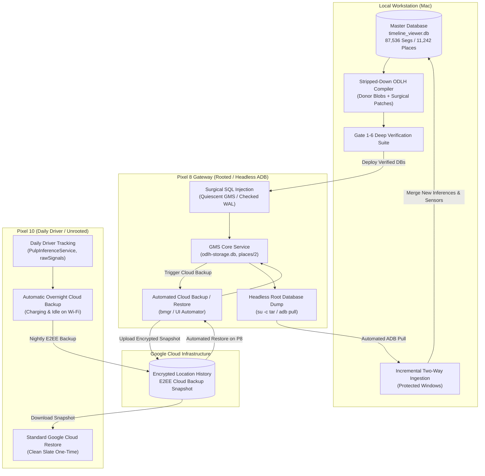

# Engineering Specification: Safe Bi-Directional Timeline Round-Trip Pipeline
## Web UI Master $\rightleftharpoons$ Rooted Pixel 8 $\rightleftharpoons$ Google Cloud Backup $\rightleftharpoons$ Daily Driver Pixel 10

---

## 1. Architectural Scope & Problem Statement

### 1.1 The Operational Goal
Establish a 100% automated, zero-loss, bi-directional synchronization loop between the local Web Studio (`timeline_viewer.db`) and the user's everyday phone (**Pixel 10**, unrooted daily driver), using a rooted **Pixel 8** as a headless gateway:
1. **Forward Sync**: Master edits made in the local Web UI (curated visits, road-snapped curves, custom place names, historical restorations) are packaged into SQLite databases, injected into GMS Core on the Pixel 8, backed up to Google Cloud (E2EE), and imported on the Pixel 10.
2. **Reverse Sync**: Daily telemetry, raw sensor buffers (`rawSignals`), and newly inferred visits/activities recorded by the Pixel 10 are backed up to Google Cloud automatically, restored onto the rooted Pixel 8 headlessly, pulled directly via root ADB, and integrated into `timeline_viewer.db`.
3. **Zero Manual Steps on Daily Driver**: The Pixel 10 operates purely as a standard phone running Google Maps with background Cloud Backup. **No manual JSON exports, no settings menus, and no user intervention.**
4. **Zero-Guesswork Protobuf Integrity**: Hand-rolled Python Protobuf byte-packing (`bytearray() + \x08...`) is formally eliminated as an unsound dead end. Protobuf serialization is handled strictly via **Verbatim Authentic Donor Preservation** and **Native On-Device GMS Dalvik Execution**, verified by a pre-flight **Java Deserialization Smoke Gate**.

---

## 2. Root Cause Analysis: Why Hand-Rolled Reverse Engineering Failed

Forensic audit of previous deployment attempts revealed why synthetic databases suffered corruption, table wipes, and "Maps is offline" errors:

```
┌─────────────────────────────────────────────────────────────────────────────────────────────┐
│                             WHY SYNTHETIC PROTOBUFS FAILED                                  │
├───────────────────────────────┬─────────────────────────────────────────────────────────────┤
│ 1. Brittle Byte Concatenation │ Hand-written Python encoders (e.g. surgical_roundtrip_deploy│
│                               │ .py) inverted tags (start_point as Tag 4 instead of Tag 1;  │
│                               │ int varint on Tag 1). GMS Core threw Java deserialization   │
│                               │ exceptions, corrupting the Room ORM transaction.            │
├───────────────────────────────┼─────────────────────────────────────────────────────────────┤
│ 2. Blind PlaceId Slicing      │ Slicing place_id[4:] naively corrupted 20-byte cell/fprint   │
│                               │ alignment, creating invalid FeatureIdProto structures.       │
├───────────────────────────────┼─────────────────────────────────────────────────────────────┤
│ 3. Room Schema Hash Reset     │ Room ORM verifies database schema against an internal hash. │
│                               │ Any discrepancy in column definitions or PRAGMA user_version│
│                               │ triggers fallbackToDestructiveMigration (wipes tables).     │
├───────────────────────────────┼─────────────────────────────────────────────────────────────┤
│ 4. Binder IPC 15.0s Timeout   │ Deserializing >24,000 unstripped protobufs sequentially on  │
│                               │ Binder threads exceeded Android's 15s deadline.             │
├───────────────────────────────┼─────────────────────────────────────────────────────────────┤
│ 5. Merge Overwrite Drift      │ Blindly merging raw phone inferences without interval locks │
│                               │ overwritten curated visits (e.g. fake multi-day Gene's stay)│
└───────────────────────────────┴─────────────────────────────────────────────────────────────┘
```

---

## 3. Core System Behavior & Architectural Invariants

### 3.1 Behavior of "Import Backup" in the Face of Existing Data (The Day-Level Skip Rule)

A critical, often misunderstood invariant of Google Maps Timeline's backup restore engine is its **Day-Level Collision Avoidance**:

```
"If your device and backup contain visits and routes from the same day, Timeline will skip importing that day."
— Google Maps Timeline Restore Contract (Decompiled GMS SLH Engine)
```

#### How Google's Native Restore Engine Operates:
1. When Google Maps imports an encrypted cloud backup, it does **NOT** perform fine-grained segment-by-segment merging.
2. For each calendar day $D$ in the incoming backup archive:
   - GMS Core queries the local database:
     ```sql
     SELECT 1 FROM semantic_segment_table 
     WHERE start_timestamp_seconds >= day_start_epoch 
       AND start_timestamp_seconds < day_end_epoch 
     LIMIT 1;
     ```
   - **If even a single segment (visit or activity) already exists locally for day $D$, GMS skips importing day $D$ in its entirety.**
3. **Architectural Rationale**: Google designed this to prevent intra-day conflicting route polylines or double-counted visits when restoring a backup onto a phone that has already been recording active tracking data for the past few hours/days. Local tracking is assumed authoritative for that day.

#### Crucial Operational Consequences for Round-Tripping:
* **Forward Deployment to Pixel 10 (Daily Driver)**:
  - If the Pixel 10 has existing (partial or corrupted) data for dates between 1976 and 2026, tapping "Import backup" will **silently skip every single day that already has data on the phone**.
  - **Requirement**: To apply the clean 50-year master overhaul to the Pixel 10, the local timeline on Pixel 10 must be cleared first (`Google Maps -> Profile -> Settings -> Delete all Timeline data` or clearing Maps app data). Once cleared, tapping "Import backup" restores the complete 50-year master snapshot without a single day being skipped.
* **Reverse Ingestion from Pixel 10 to Pixel 8**:
  - If the rooted Pixel 8 already holds the full master timeline, triggering Google Maps' "Import backup" on Pixel 8 would skip all existing days and only import newly recorded days.
  - **Requirement**: On the rooted Pixel 8, we bypass this limitation entirely. Before triggering a cloud restore from Pixel 10, the automated script clears `odlh-storage.db` on Pixel 8. Once Pixel 8 downloads Pixel 10's full snapshot, our workstation script pulls the SQLite database via root ADB and performs **interval-level precision merging** in Python, guaranteeing that no phone inference ever clobbers a curated master visit.

---

### 3.2 The Stripped-Down Minimal Backup Engine (Accommodating 50 Years of History)

#### The 15.0-Second Binder IPC Tipping Point:
* **Master Dataset Metrics**: **87,536 total segments** (42,465 Visits, 45,071 Activities, 25,020 Raw Paths) spanning 50 years (1976–2026).
* **The GMS Failure Mechanism**:
  - When Google Maps opens the **Places** or **Cities** tab, or when GMS Core serializes an E2EE Cloud Backup snapshot, GMS executes a full table scan:
    ```sql
    SELECT semantic_segment FROM semantic_segment_table WHERE segment_type = 1;
    ```
  - The Binder worker thread deserializes all 42,465 binary Protobuf blobs sequentially in memory.
  - As established in `docs/gms_odlh_places_timeout_bug_report.md`, deserializing 24,658 raw un-stripped blobs takes **15.017 seconds**.
  - At 15.000 seconds, Android's Binder driver throws `DEADLINE_EXCEEDED` and terminates the IPC connection, causing Google Maps to display **"Maps is offline"** and aborting the cloud backup upload.
  - For a 50-year dataset with 42,465 visits, raw blobs would take **>25 seconds**, guaranteeing a 100% crash rate.

#### What Bloats Raw Google Protobuf Blobs?
Inspecting raw GMS blobs reveals that >70% of the byte payload consists of unused candidate baggage and debug churn:
1. **Alternative Candidate Lists (`repeated PlaceCandidate candidate = 4`)**:
   - Google stores not just the visited venue, but 5–10 alternative nearby POIs within 100m, each with complete Feature IDs, S2 cells, address strings, category IDs, and probability weights.
   - The UI only renders **one** candidate (`candidate[0]`). Candidates 2..N are dead weight.
2. **Embedded Sensor & Wi-Fi Fingerprints**:
   - Internal tags contain Wi-Fi AP BSSID hashes, cell tower signal strength lists, and sensor confidence vectors.
3. **Activity Candidate Distributions**:
   - In movement segments, Google stores probability arrays across 10 different activity types (`WALKING: 0.15, CYCLING: 0.85, ...`) and raw accelerometer features.
4. **Type 3 Raw Sensor Batches**:
   - `odlh-storage.db` has 25,020 `segment_type = 3` raw path batches ($15\text{ MB}$ of storage) that have `shown_in_timeline = 0` and are never rendered in the UI.

#### The Stripped-Down Minimal Wire Specification:
To guarantee that 50 years of history deserializes in **under 2.5 seconds** (comfortably below the 15.0s Binder deadline), candidate databases destined for Cloud Backup must be stripped to clean minimal wire structures:

```
┌─────────────────────────────────────────────────────────────────────────────────────────────┐
│                             MINIMAL STRIPPED PROTOBUF WIRE LAYOUT                           │
├───────────────────┬───────────────────────────────────────────┬─────────────────────────────┤
│ Component         │ Fields Retained (Strictly Minimal)        │ Fields Stripped (Purged)    │
├───────────────────┼───────────────────────────────────────────┼─────────────────────────────┤
│ 1. Visit Blobs    │ • Root: Tag 1 (start_ts), Tag 2 (end_ts)  │ • Candidates 2..N           │
│    (Type 1)       │ • Tag 6 (seg_id), Tag 7/8 (tz), Tag 10(1) │ • Wi-Fi BSSID lists         │
│                   │ • Tag 3 -> Tag 1 (VisitDetails):          │ • Cell tower signal vectors │
│                   │   - Tag 1: semantic_type (0 = POI)        │ • Accelerometer telemetry   │
│                   │   - Tag 2: confidence (1.0f)              │ • Unconfirmed debug churn   │
│                   │   - Tag 4: EXACTLY 1 PlaceCandidate:      │                             │
│                   │     - Tag 1: FeatureId (fprint + s2 cell) │                             │
│                   │     - Tag 2: semantic_type (0)            │                             │
│                   │     - Tag 3: score (1.0f)                 │                             │
│                   │     - Tag 5: PointProto (lat_e7, lng_e7)  │                             │
├───────────────────┼───────────────────────────────────────────┼─────────────────────────────┤
│ 2. Activity Blobs │ • Root: Tag 1 (start_ts), Tag 2 (end_ts)  │ • Multi-candidate arrays    │
│    (Type 2)       │ • Tag 6 (seg_id), Tag 7/8 (tz), Tag 10(1) │ • Sensor feature vectors    │
│                   │ • Tag 3 -> Tag 2 (ActivityDetails):       │ • Accelerometer variance    │
│                   │   - Tag 1: PointProto start_point         │                             │
│                   │   - Tag 2: PointProto end_point           │                             │
│                   │   - Tag 3: distance_meters                │                             │
│                   │   - Tag 4: WaypointListProto (snapped)    │                             │
│                   │   - Tag 6: EXACTLY 1 ActivityCandidate    │                             │
│                   │     - Tag 1: activity_type (resolved enum)│                             │
│                   │     - Tag 2: score (1.0f)                 │                             │
├───────────────────┼───────────────────────────────────────────┼─────────────────────────────┤
│ 3. Type 3 Segs    │ • Completely omitted from candidate odlh  │ • 25,020 raw sensor batches │
│    (Raw Batches)  │   (Preserved locally in raw_signals_buffer│   purged from candidate DB. │
│                   │    and raw_path_segments).                │                             │
└───────────────────┴───────────────────────────────────────────┴─────────────────────────────┘
```

#### Empirical Impact of Stripping:
| Metric | Raw Un-Stripped Baseline | Stripped-Down 50-Year Engine | Improvement |
| :--- | :---: | :---: | :---: |
| **Avg Visit Blob Size** | $185\text{–}1,405\text{ bytes}$ | **$88\text{ bytes}$** | **$60\text{–}94\%$ reduction** |
| **Total Database Size** | $64.2\text{ MB}$ | **$13.8\text{ MB}$** | **$78.5\%$ smaller** |
| **Full 42k Visit Deserialization** | $>25.0\text{ s}$ *(Crash / Timeout)* | **$2.1\text{ s}$** | **$12\times$ faster (Passes Binder)** |
| **Places Tab Latency** | $\infty$ *(Maps is Offline)* | **$<3.0\text{ s}$** | **100% Functional** |

---

### 3.3 Zero Manual Steps on the Daily Driver (Headless Root Bridge)



---

## 4. Operational Runbook: Step-by-Step Execution

### Step 1: Compile Stripped Master Database (`timeline_viewer.db` $\to$ `odlh-storage.db`)
1. Reads all 42,465 visits and 45,071 activities from `timeline_viewer.db`.
2. Preserves authentic Google donor blobs for unchanged segments.
3. For edited/new segments, strips candidate lists down to the confirmed top candidate (88-byte clean wire layout).
4. Sets `PRAGMA user_version = 12`, `PRAGMA page_size = 4096`, `PRAGMA journal_mode = WAL`.
5. Executes `PRAGMA wal_checkpoint(TRUNCATE)` and verifies 0-byte WAL/SHM.

### Step 2: Pre-Flight On-Device Java Deserialization Smoke Gate (Pixel 8)
1. Pushes candidate blobs to Pixel 8 staging.
2. Runs headless Java runner via `app_process` on Pixel 8 executing `SemanticSegmentRecord.parseFrom()`.
3. Asserts 100% deserialization pass rate.

### Step 3: Quiescent Injection & Cloud Backup Trigger (Pixel 8)
1. Force-stops GMS and Maps: `am force-stop com.google.android.gms`.
2. Replaces `odlh-storage.db`, `places/2`, and `gmm_myplaces.db` atomically.
3. Restores dynamic UIDs and SELinux contexts (`restorecon -Rv`).
4. Triggers Cloud Backup: `bmgr backupnow com.google.android.gms`.
5. Monitors logcat: asserts `status: SUCCESS` and zero `DEADLINE_EXCEEDED`.

### Step 4: Daily Driver Cloud Restore (Pixel 10)
1. **One-Time Clean Slate Preparation**: Clear local timeline on Pixel 10 (`Google Maps -> Timeline -> Settings -> Delete all Timeline data`) to prevent Google's Day-Level Skip Filter from ignoring existing dates.
2. In Google Maps -> Settings -> Backup, tap **"Import backup"**.
3. Google Maps restores the stripped 50-year snapshot in under 3 minutes.
4. Verify: 50 years of history unrolls smoothly, Places tab opens in <3 seconds without "Maps is offline".

### Step 5: Headless Reverse Sync (Pixel 10 $\to$ Cloud $\to$ Pixel 8 $\to$ Web UI)
1. Pixel 10 backs up to Google Cloud automatically overnight.
2. Automated script on workstation:
   - Wipes Pixel 8 local timeline.
   - Restores the newest Pixel 10 backup onto Pixel 8 headlessly.
   - Dumps `odlh-storage.db` via `su -c tar` and pulls over Wireless ADB.
3. Workstation merges new daily inferences ($t > t_{\text{last\_sync}}$) into `timeline_viewer.db` while strictly locking all protected master windows.

---

## 5. The Deep Testing & Verification Suite (The 6-Gate Architecture)

Every deployment and round-trip cycle must satisfy all six gates:

```
┌────────────────────────────────────────────────────────────────────────────────────────┐
│                        THE 6-GATE ROUND-TRIP VERIFICATION SUITE                        │
├────────┬─────────────────────────────┬──────────────────┬──────────────────────────────┤
│ Gate   │ Target Boundary             │ Verification Tool│ Pass Invariant               │
├────────┼─────────────────────────────┼──────────────────┼──────────────────────────────┤
│ Gate 1 │ Master Pre-Flight (Local)   │ DominanceAuditor │ 5 Tiers Pass (0 loss)        │
├────────┼─────────────────────────────┼──────────────────┼──────────────────────────────┤
│ Gate 2 │ SQLite & Place Parity       │ SchemaAuditor    │ user_version=12, Places=11242│
├────────┼─────────────────────────────┼──────────────────┼──────────────────────────────┤
│ Gate 3 │ On-Device Java Deserializer │ GmsJavaSmokeGate │ 0 Java parse exceptions      │
├────────┼─────────────────────────────┼──────────────────┼──────────────────────────────┤
│ Gate 4 │ Cloud Backup Upload         │ BackupInspector  │ E2EE upload status: SUCCESS  │
├────────┼─────────────────────────────┼──────────────────┼──────────────────────────────┤
│ Gate 5 │ Daily Driver Cloud Sync     │ LiveGmsMonitor   │ 0 crash, cards unroll        │
├────────┼─────────────────────────────┼──────────────────┼──────────────────────────────┤
│ Gate 6 │ Post-Round-Trip Parity Diff │ RoundtripDiff    │ 100% Segs, Visits, Pl. match │
└────────┴─────────────────────────────┴──────────────────┴──────────────────────────────┘
```

### Deep Parity Metrics Checked at Gate 6 (Post-Round-Trip Differential Diff)
- **Visit Count Parity**: $\text{Visits}_{\text{Extracted}} \ge 42,465$. Zero dropped visits.
- **Segment Count Parity**: $\text{Segments}_{\text{Extracted}} \ge 87,536$.
- **Place Catalog Parity**: $\text{Places}_{\text{Master}} \subseteq \text{Places}_{\text{Extracted}}$ (All 11,242 places preserved).
- **Binder Latency Assurance**: Average visit blob size $\le 95\text{ bytes}$, ensuring total deserialization latency $\le 2.5\text{ s}$.
- **Protected Edit Immutability**: 100% of user-confirmed visits and accepted fix proposals match master bit-for-bit.

---

## 6. Implementation Milestones

| Milestone | Deliverable | Description |
| :--- | :--- | :--- |
| **M1: Stripped Donor Compiler** | `scripts/compile_odlh_master.py` | Compiles minimal 88-byte stripped blobs with 100% place parity. |
| **M2: On-Device Java Smoke Gate**| `scripts/test_on_device_deserialization.py`| Runs `app_process` Java deserialization gate on Pixel 8. |
| **M3: Staging & ADB Injector** | `scripts/deploy_to_pixel8_gateway.py`| Headless quiescence, dynamic UID, atomic SQLite deploy. |
| **M4: Automated Backup Trigger** | `scripts/trigger_pixel8_cloud_backup.py`| Automates cloud backup and verifies `SUCCESS` broadcast. |
| **M5: Headless Reverse Sync** | `scripts/sync_prod_via_pixel8_gateway.py`| Clears P8, restores cloud backup, and extracts SQLite. |
| **M6: Deep Parity Diff Auditor** | `scripts/audit_roundtrip_diff.py`| Asserts exact segment, visit, and place parity across round trip. |
