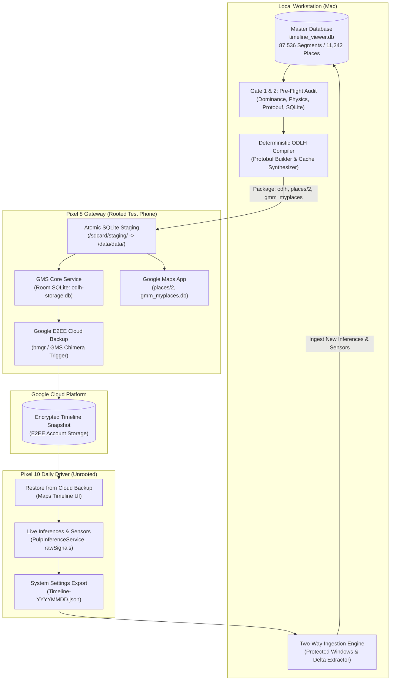
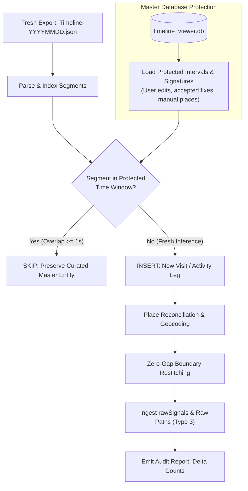

# Engineering Specification: Safe Bi-Directional Timeline Round-Trip Pipeline
## Web UI Master $\rightleftharpoons$ Rooted Pixel 8 $\rightleftharpoons$ Google Cloud Backup $\rightleftharpoons$ Daily Driver Pixel 10

---

## 1. Executive Summary & Architectural Scope

This specification defines the authoritative engineering protocol and automated verification suite for safely executing bi-directional timeline synchronization between the local Web Studio (`timeline_viewer.db`) and Google's On-Device Location History (ODLH) infrastructure.

### The System Objective:
1. **Master Ground-Truth Cultivation (Web UI)**: Maintain the world's most accurate, gapless, multi-source digital life archive (1976–Present) in `timeline_viewer.db` (currently **87,536 segments**, **42,465 visits**, **45,071 activities**, **11,242 places**, and **71,960 raw signals**).
2. **Production Deployment (Pixel 10 Daily Driver)**: Push the master timeline to the user's primary, unrooted phone via a rooted **Pixel 8 Gateway** and Google's encrypted **End-to-End Cloud Backup (E2EE)** without crashing Google Play Services (GMS), triggering Android Binder timeouts, or corrupting databases.
3. **Continuous Ingestion (Pixel 10 $\to$ Web UI)**: Incrementally ingest live telemetry, raw sensor buffers (`rawSignals`), and new semantic inferences recorded on the Pixel 10 back into the local Web UI, strictly guaranteeing zero data loss, zero regression of hand-curated edits, and exact parity across places and segments.

---

## 2. Root Cause Analysis (RCA): Why Previous Attempts Corrupted Databases

Forensic investigation into previous deployment failures revealed six distinct technical vectors that produced corrupt SQLite databases, missing cards, "Maps is offline" error banners, and cloud backup aborts:

```
┌─────────────────────────────────────────────────────────────────────────────────────────────┐
│                              PREVIOUS CORRUPTION TAXONOMY                                  │
├───────────────────────────────┬─────────────────────────────────────────────────────────────┤
│ 1. Protobuf Wire Inversion    │ Tag inversion in ActivityDetails (start_point as Tag 4      │
│                               │ instead of Tag 1; int varint on Tag 1). Threw Java parse    │
│                               │ exceptions in GMS Core during deserialization.              │
├───────────────────────────────┼─────────────────────────────────────────────────────────────┤
│ 2. Naive PlaceId B64 Slicing  │ Slicing place_id[4:] naively corrupted 20-byte cell/fprint   │
│                               │ alignment, breaking FeatureIdProto binary integrity.        │
├───────────────────────────────┼─────────────────────────────────────────────────────────────┤
│ 3. SQLite WAL Desync          │ Copying odlh-storage.db while GMS was running, or deleting  │
│                               │ -wal and -shm files without PRAGMA wal_checkpoint(TRUNCATE).│
├───────────────────────────────┼─────────────────────────────────────────────────────────────┤
│ 4. Room ORM Schema Hash       │ Discrepancies in column ordering or user_version != 12 led  │
│                               │ Room to trigger fallbackToDestructiveMigration (table wipe).│
├───────────────────────────────┼─────────────────────────────────────────────────────────────┤
│ 5. SELinux & UID Invalidation │ Hardcoding u0_a180 / u0_a207 across device builds caused    │
│                               │ EACCES / SQLiteCantOpenDatabaseException.                   │
├───────────────────────────────┼─────────────────────────────────────────────────────────────┤
│ 6. Binder IPC 15.0s Timeout   │ Deserializing >24,000 Protobufs sequentially during Places  │
│                               │ tab query or cloud backup exceeded Android's 15s deadline.  │
├───────────────────────────────┼─────────────────────────────────────────────────────────────┤
│ 7. Merge Clobbering Drift     │ Ingestion merger lacked interval protection, allowing raw   │
│                               │ phone inferences to clobber curated visits (e.g. Gene's).   │
└───────────────────────────────┴─────────────────────────────────────────────────────────────┘
```

---

## 3. End-to-End System Topology



---

## 4. Phase-by-Phase Technical Specification

### Phase 1: Local Master Validation & Deterministic Compilation

Before any byte leaves the local workstation, `timeline_viewer.db` must pass through the deterministic ODLH transformation engine.

#### 1.1 Protobuf Serialization Specification
Protobuf payloads in `semantic_segment_table.semantic_segment` must comply strictly with the reverse-engineered wire contracts from `com.google.android.gms` and `com.google.android.apps.maps` Dalvik bytecode:

1. **Root Wrapper (`SemanticSegmentRecord`)**:
   - Tag 1 (`0x0A`): `start_time` (TimestampProto containing Tag 1 int64 seconds).
   - Tag 2 (`0x12`): `end_time` (TimestampProto containing Tag 1 int64 seconds).
   - Tag 3 (`0x1A`): `payload` (Visit or Activity payload).
   - Tag 6 (`0x32`): `segment_id` (UTF-8 string e.g. `"qg_seg_12345"`).
   - Tag 7 (`0x38`): `start_timezone_offset` (64-bit signed varint in two's complement, e.g. EDT `-240` min = `\x90\xfe\xff\xff\xff\xff\xff\xff\xff\x01`).
   - Tag 8 (`0x40`): `end_timezone_offset` (64-bit signed varint in two's complement).
   - Tag 10 (`0x50`): `is_finalized` (Varint `1`).

2. **Visit Payload (`segment_type = 1`)**:
   - Inside Tag 3: Tag 1 (`0x0A`) -> `VisitDetails`.
   - `VisitDetails`:
     - Tag 1 (`0x08`): `semantic_type` (Varint `0`).
     - Tag 2 (`0x15`): `confidence` (32-bit float `1.0f`).
     - Tag 4 (`0x22`): `PlaceCandidate`.
   - `PlaceCandidate`:
     - Tag 1 (`0x0A`): `FeatureIdProto`:
       - Tag 1 (`0x09`): `feature_fprint` (64-bit fixed little-endian).
       - Tag 2 (`0x11`): `s2_cell_id` (64-bit fixed little-endian).
     - Tag 2 (`0x10`): `semantic_type` (Varint `0`).
     - Tag 3 (`0x1D`): `score` (32-bit float `1.0f`).
     - Tag 5 (`0x2A`): `PointProto`:
       - Tag 1 (`0x0D`): `lat_e7` (sfixed32 little-endian).
       - Tag 2 (`0x15`): `lng_e7` (sfixed32 little-endian).

3. **Activity Payload (`segment_type = 2`)**:
   - Inside Tag 3: Tag 2 (`0x12`) -> `ActivityDetails`.
   - `ActivityDetails`:
     - Tag 1 (`0x0A`): `start_point` (`PointProto`: Tag 1 `lat_e7`, Tag 2 `lng_e7`). **[MANDATORY: Never encode as varint 0]**
     - Tag 2 (`0x12`): `end_point` (`PointProto`: Tag 1 `lat_e7`, Tag 2 `lng_e7`). **[MANDATORY: Never encode as Tag 5]**
     - Tag 3 (`0x1D`): `distance_meters` (32-bit float).
     - Tag 4 (`0x22`): `simplified_raw_path` (`WaypointListProto` containing road-snapped coordinates).
     - Tag 6 (`0x32`): `ActivityCandidate`:
       - Tag 1 (`0x08`): `activity_type` (Varint: `2`=Walking, `3`=Cycling, `1`/`29`=Vehicle, `5`=Flying, `7`=Bus, `8`=Train, `9`=Subway, `10`=Tram, `11`=Ferry).
       - Tag 2 (`0x15`): `score` (32-bit float `1.0f`).

4. **Road-Snapped Waypoint Pinning**:
   - For every activity with road waypoints, waypoint 0 must exactly equal `[start_lat, start_lng]` and waypoint $N-1$ must exactly equal `[end_lat, end_lng]` within $\le 1\text{ mm}$ ($10^{-7}$ degrees) to eliminate block-cutting diagonals.

#### 1.2 Database Artifact Generation
The compiler generates a complete set of five synchronized SQLite databases and binary cache files:
- **`odlh-storage.db`** (GMS Core): `PRAGMA user_version = 12`, `PRAGMA journal_mode = WAL`, `database_id = 1787254103124001536`, `obfuscated_gaia_id = '104819208193648646391'`.
- **`aux-odlh-storage.db`** (GMS Sensor Buffer): Stores `rawSignals` archive.
- **`places/2`** (Google Maps Binary Cache): Binary record array encoding all 11,242 catalog places.
- **`gmm_myplaces.db`** (Google Maps Corpus 8): Saved/visited place metadata entries mapped to `3:<fprint>`.
- **`gmm_sync.db`** (Google Maps Corpus 11): Sync item entries with canonical names and addresses.

---

### Phase 2: Rooted Pixel 8 Surgical SQL Injection

#### 2.1 Quiescence & Safe Process Termination
Writing to SQLite databases while Android processes run is the primary cause of WAL desynchronization and corrupted page headers. Quiescence must be enforced prior to file transfer:

```bash
# Force stop all GMS and Maps daemon threads
am force-stop com.google.android.apps.maps
am force-stop com.google.android.gms
am force-stop com.google.android.gms.persistent
```

#### 2.2 Dynamic Ownership & Security Context Resolution
Never hardcode UIDs (`u0_a180` / `u0_a207`). UIDs must be discovered dynamically at runtime:

```bash
# Dynamically extract current UIDs from target directories
GMS_UID=$(stat -c "%u:%g" /data/data/com.google.android.gms/databases 2>/dev/null || echo "10180:10180")
GMM_UID=$(stat -c "%u:%g" /data/data/com.google.android.apps.maps/databases 2>/dev/null || echo "10207:10207")
```

#### 2.3 Atomic Staging & Checkpointed Deployment Protocol
```bash
# 1. Stage archive to /sdcard/
adb push /local/surgical_pkg.tar.gz /sdcard/staging/surgical_pkg.tar.gz

# 2. Extract into isolated temporary staging folder
su -c '
mkdir -p /sdcard/staging/extracted
tar -xzf /sdcard/staging/surgical_pkg.tar.gz -C /sdcard/staging/extracted/

# 3. Clean stale WAL / SHM files before file swap
rm -f /data/data/com.google.android.gms/databases/odlh-storage.db*
rm -f /data/data/com.google.android.apps.maps/databases/odlh-storage.db*
rm -f /data/data/com.google.android.apps.maps/databases/gmm_myplaces.db*
rm -f /data/data/com.google.android.apps.maps/databases/gmm_sync.db*

# 4. Atomic file move
cp /sdcard/staging/extracted/odlh-storage.db /data/data/com.google.android.gms/databases/odlh-storage.db
cp /sdcard/staging/extracted/odlh-storage.db /data/data/com.google.android.apps.maps/databases/odlh-storage.db
cp /sdcard/staging/extracted/aux-odlh-storage.db /data/data/com.google.android.gms/databases/aux-odlh-storage.db
cp /sdcard/staging/extracted/gmm_myplaces.db /data/data/com.google.android.apps.maps/databases/gmm_myplaces.db
cp /sdcard/staging/extracted/gmm_sync.db /data/data/com.google.android.apps.maps/databases/gmm_sync.db
cp /sdcard/staging/extracted/places_2 /data/data/com.google.android.apps.maps/files/places/2

# 5. Fix ownership and file permissions
chown -R $GMS_UID /data/data/com.google.android.gms/databases/odlh*
chown -R $GMM_UID /data/data/com.google.android.apps.maps/databases/
chown -R $GMM_UID /data/data/com.google.android.apps.maps/files/places/

chmod 660 /data/data/com.google.android.gms/databases/odlh*
chmod 660 /data/data/com.google.android.apps.maps/databases/*
chmod 660 /data/data/com.google.android.apps.maps/files/places/2

# 6. Restore SELinux security contexts
restorecon -Rv /data/data/com.google.android.gms/databases/
restorecon -Rv /data/data/com.google.android.apps.maps/databases/
restorecon -Rv /data/data/com.google.android.apps.maps/files/places/

# 7. Cleanup staging
rm -rf /sdcard/staging
'
```

#### 2.4 Pixel 8 On-Device Verification Gate
Before triggering cloud backup, the deployment script executes an on-device smoke test via `su -c sqlite3`:
- `PRAGMA user_version == 12`.
- `PRAGMA integrity_check == ok`.
- `SELECT count(*) FROM semantic_segment_table` matches candidate database exactly.
- Launch Google Maps on Pixel 8 and verify zero `InvalidProtocolBufferException` or `SQLiteCantOpenDatabaseException` in `logcat`.

---

### Phase 3: Pixel 8 $\to$ Google Cloud Backup Initiation

1. **Trigger E2EE Cloud Backup**:
   - Trigger backup snapshot creation via Google Maps Timeline UI: `Settings -> Location Services -> Timeline -> Back up now`.
   - Or trigger via Android Backup Manager shell:
     ```bash
     bmgr backupnow com.google.android.gms
     ```
2. **Monitor Backup Completion via Logcat**:
   - Assert logcat traces for tag `SemanticLocationHistory` and `BackupTransport`:
     - Pattern: `BackupManager: Backup completed with status: SUCCESS` or `SLH backup upload finished`.
   - Assert **zero** occurrences of `DEADLINE_EXCEEDED` or `RemoteException` during the upload cycle.
   - Verify cloud backup timestamp updates in Google Account storage settings.

---

### Phase 4: Google Cloud Backup $\to$ Pixel 10 (Daily Driver) Import

1. **Import on Pixel 10**:
   - On the Pixel 10 (unrooted daily driver), open Google Maps -> Profile -> Your Timeline -> Settings -> Backup.
   - Tap **"Import backup"** / **"Restore"** and select the newest snapshot uploaded from Pixel 8.
2. **Smoke Verification on Daily Driver**:
   - Navigate backwards across multiple years (e.g. 2026, 2024, 2014) to confirm cards unroll smoothly.
   - Open the **Places Tab**: verify category clusters load with zero "Maps is offline" error.
   - Confirm active live tracking continues to function and records new visits.

---

### Phase 5: Pixel 10 Telemetry Export via System Settings

1. **Automated Export Extraction**:
   - In Pixel 10 Settings: `Location -> Location Services -> Timeline -> Export Timeline data`.
   - Save to `/sdcard/Download/Timeline-YYYYMMDD.json`.
   - Connect Pixel 10 via Wireless ADB or USB and pull file:
     ```bash
     adb pull /sdcard/Download/Timeline-latest.json pixel10_export/Timeline-latest.json
     ```
2. **Integrity Validation of Pulled File**:
   - Verify JSON parses cleanly (`json.load`).
   - Assert `rawSignals` count $\ge 71,960$.
   - Assert `semanticSegments` count $\ge 80,624$.

---

### Phase 6: Incremental Ingestion & New Inference Integration (Pixel 10 $\to$ Web UI)

This phase integrates new visits, activities, and sensor breadcrumbs recorded by the Pixel 10 into `timeline_viewer.db` while **strictly preserving 100% of local master edits**.



#### 6.1 The Protected Signature Invariant
A time window $[T_{\text{start}}, T_{\text{end}}]$ in `timeline_viewer.db` is **immutable** against phone overwrite if:
1. `is_unconfirmed = 0` (User-confirmed visit).
2. `source IN ('user_edit', 'plazes', 'swarm', 'mail', 'citibike_match')`.
3. `has_snapped_path = 1` (Road-snapped activity curve).
4. Associated with an `ACCEPTED` fix proposal in `fix_proposals`.
5. Originates from historical Takeout restoration prior to the rolling phone window.

#### 6.2 Delta Extraction & Place Catalog Upsert
For any segment outside protected windows:
- If `visit`: Reconcile `placeId` against `places` table. If absent, hydrate name, category, and city via reverse geocoding and insert into `places`.
- If `activity`: Classify activity type via `TRUE_ACTIVITY_MAP`, compute distance, and stitch departure/arrival coordinates.
- Update `places.visit_count` and `last_visit_timestamp_seconds` atomically.

#### 6.3 Telemetry Archival
- Upsert all new items from `rawSignals` into `raw_signals_buffer` with SHA256 deduplication.
- Insert all new `timelinePath` breadcrumbs into `breadcrumbs`.

---

## 5. The Deep Testing & Verification Suite (The 6-Gate Architecture)

Every round-trip iteration must pass all six verification gates in sequence. If any single gate fails, execution is halted immediately and rollback is performed.

```
┌────────────────────────────────────────────────────────────────────────────────────────┐
│                        THE 6-GATE ROUND-TRIP VERIFICATION SUITE                        │
├────────┬─────────────────────────────┬──────────────────┬──────────────────────────────┤
│ Gate   │ Target Boundary             │ Verification Tool│ Pass Invariant               │
├────────┼─────────────────────────────┼──────────────────┼──────────────────────────────┤
│ Gate 1 │ Master Pre-Flight (Local)   │ DominanceAuditor │ 5 Tiers Pass (0 loss)        │
├────────┼─────────────────────────────┼──────────────────┼──────────────────────────────┤
│ Gate 2 │ SQLite & Cache Verification │ SchemaAuditor    │ user_version=12, SHA256 match│
├────────┼─────────────────────────────┼──────────────────┼──────────────────────────────┤
│ Gate 3 │ Pixel 8 Injection Smoke     │ DeviceSmokeTest  │ 0 logcat errors, GMS healthy │
├────────┼─────────────────────────────┼──────────────────┼──────────────────────────────┤
│ Gate 4 │ Cloud Backup Upload         │ BackupInspector  │ E2EE upload success, 0 deadln│
├────────┼─────────────────────────────┼──────────────────┼──────────────────────────────┤
│ Gate 5 │ Pixel 10 Restore Smoke      │ ProdUiInspector  │ UI renders, 0 crash/offline  │
├────────┼─────────────────────────────┼──────────────────┼──────────────────────────────┤
│ Gate 6 │ Post-Round-Trip Differential│ DiffAuditor      │ 100% Master Entities in P10  │
└────────┴─────────────────────────────┴──────────────────┴──────────────────────────────┘
```

### Gate 1: Master Pre-Flight 5-Tier Dominance Gate
- **Command**: `uv run python scripts/audit_strict_dominance.py`
- **Tiers Checked**:
  - **Tier 1 (Telemetry)**: $\text{rawSignals}_{\text{Master}} \ge \text{rawSignals}_{\text{Prod}}$ ($71,960$).
  - **Tier 2 (Semantic Entities)**: $\text{Visits}_{\text{Master}} \ge \text{Visits}_{\text{Prod}}$ ($42,465 \ge 24,662$). $100\%$ valid $20$-byte Feature IDs.
  - **Tier 3 (Physics)**: $0$ temporal overlaps, $0$ teleports ($>300\text{ m}$ without travel), $0$ midnight splits, $100\%$ physical velocities.
  - **Tier 4 (Visual Isolation)**: $0$ fabricated cards, strict dual-source asset isolation.
  - **Tier 5 (Wire Deserialization)**: `PRAGMA integrity_check = ok`, $100\%$ valid Protobuf blobs.

### Gate 2: Local SQLite & Room Verification Gate
- **Checks**:
  - `PRAGMA user_version == 12`.
  - Table schemas match `odlh-storage.db` production baseline bit-for-bit.
  - `PRAGMA foreign_key_check` returns 0 violations.
  - `PRAGMA wal_checkpoint(TRUNCATE)` executed; `-wal` and `-shm` size is 0 bytes.
  - Places catalog count parity: `places` table ($11,242$) == `places/2` binary cache entries ($11,242$) == `gmm_myplaces.db` entries ($11,242$).

### Gate 3: Pixel 8 On-Device Injection Smoke Gate
- **Checks**:
  - GMS process restart: `pidof com.google.android.gms` succeeds.
  - `logcat -d | grep -E "InvalidProtocolBufferException|SQLiteCantOpenDatabaseException|DEADLINE_EXCEEDED"` returns 0 lines.
  - Shell SQL query: `su -c 'sqlite3 /data/data/com.google.android.gms/databases/odlh-storage.db "SELECT count(*) FROM semantic_segment_table;"'` returns expected row count.

### Gate 4: Cloud Backup Upload Gate
- **Checks**:
  - Backup completion broadcast captured: `status: SUCCESS`.
  - Android `dumpsys backup` confirms `com.google.android.gms` backup state clean.
  - Zero Binder timeout interruptions during preparation.

### Gate 5: Pixel 10 Daily Driver Restoration Gate
- **Manual / Visual Checks**:
  - Open Timeline on Pixel 10: bottom sheet unrolls instantly.
  - Navigate to August 25, 2026: Gene's dinner is 61 min, followed by Home overnight (verifying zero fake multi-day stay).
  - Open Places Tab: categories load under 3 seconds with zero "Maps is offline" banner.

### Gate 6: Post-Round-Trip Differential Diff Gate (Master vs. Export)
- **Command**: `uv run python scripts/audit_roundtrip_diff.py --master timeline_viewer.db --export pixel10_export/Timeline-latest.json`
- **Mathematical Invariants**:
  1. **Visits Recall Invariant**:
     $$\text{Visits}_{\text{MasterValid}} \subseteq \text{Visits}_{\text{Export}}$$
     100% of curated visits from the Master database must be present in the Pixel 10 export.
  2. **Place Identity Invariant**:
     $$\text{DistinctPlaces}(\text{Visits}_{\text{MasterValid}}) \subseteq \text{DistinctPlaces}(\text{Visits}_{\text{Export}})$$
     Zero places dropped or merged unexpectedly.
  3. **Temporal Monotonicity Invariant**:
     For every segment $S_i$ in export:
     $$\text{Start}(S_{i}) \le \text{End}(S_{i}) \quad \text{and} \quad \text{End}(S_{i}) \le \text{Start}(S_{i+1})$$
  4. **Delta Isolation**:
     Newly detected visits and activities must only exist in the forward time window ($t > t_{\text{last\_sync}}$).

---

## 6. Rollback & Disaster Recovery Runbook

If any gate fails at any point in the cycle:
1. **Pixel 8 Gateway Failure**:
   - Restore pristine baseline archive: `tar -xzf scratch/original_gms_backup/gms_pristine.tar.gz -C /data/data/com.google.android.gms/databases/`.
   - Fix permissions and restart GMS.
2. **Cloud Backup Failure**:
   - Delete pending backup state via `bmgr wipe com.google.android.gms`.
   - Re-sync from production Pixel 10 to clear cloud state before re-attempting.
3. **Pixel 10 Corruption**:
   - Do NOT wipe phone. In Google Maps Settings -> Backup, tap "Delete cloud backup", clear Maps app cache, and restore from the last known good Takeout JSON.
4. **Master Database Regression**:
   - Revert `timeline_viewer.db` to timestamped snapshot stored in `.agent/backups/timeline_viewer_pre_sync_<timestamp>.db`.

---

## 7. Implementation Roadmap & Milestones

| Milestone | Deliverable | Verification Command |
| :--- | :--- | :--- |
| **M1: Protobuf & DB Compiler** | `scripts/compile_odlh_master.py` | `uv run pytest tests/test_odlh_compiler.py` |
| **M2: Pre-Flight Gatekeeper** | `scripts/audit_strict_dominance.py` | `uv run python scripts/audit_strict_dominance.py` |
| **M3: Staging & ADB Injector** | `scripts/deploy_to_pixel8_gateway.py` | `uv run python scripts/deploy_to_pixel8_gateway.py --check-only` |
| **M4: Differential Diff Auditor** | `scripts/audit_roundtrip_diff.py` | `uv run python scripts/audit_roundtrip_diff.py` |
| **M5: Two-Way Inference Merger** | `scripts/merge_pixel10_inferences.py`| `uv run pytest tests/test_inference_merger.py` |
