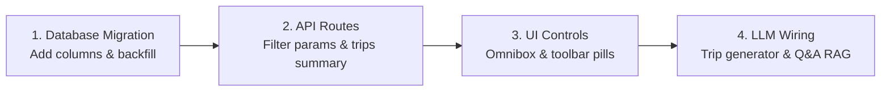

# Specification: Location Timeline Intelligence, LLM Insights, and Universal Search

---

## 1. Executive Summary & Problem Scope

Personal location history engines (Google Maps Timeline, Apple Significant Locations, and Android on-device ODLH) capture spatial coordinates and raw dwell times, but fail to deliver reflective personal value. Current implementations suffer from three core limitations:

* **Brittle, Prefix-Only Search:** Query engines require exact business name substrings. Users cannot search by memory, concept, or context (e.g. searching *"quiet cafe with wifi in Zurich during autumn 2019"* or *"tacos near the beach in San Diego"* returns zero results).
* **Flat, Unidimensional Filtering:** Filtering is restricted to static category dropdowns (*"Food & Drink"*, *"Shopping"*) and coarse city pickers. Users cannot filter by personal relationship to a place: visit frequency (*Haunts* vs. *Dormant Favorites*), stay depth (*Quick Pitstops* vs. *Deep Work Sessions*), or life eras (*College*, *New York Residency*).
* **Superficial "Insights":** Current insights interfaces deliver static monthly odometer totals (*"You walked 14 km"*, *"Top category: Food"*) with zero narrative synthesis, habit change detection, or multi-day trip journaling.

This specification details the architecture for an **intelligence and retrieval layer** operating over the canonical location master database. It delivers:
1. **Universal Natural Language Search:** A hybrid Text-to-Filter compiler executing sub-2ms parameterized queries over SQLite with zero external vector database overhead.
2. **Contextual 4-Axis Filtering:** Dynamic place exploration across Life Eras, Personal Cadence, Dwell Depth, and Category.
3. **LLM Narrative Synthesis & Longitudinal Insights:** On-demand multi-day trip chronicles, automated daily micro-digests, and conversational biographical Q&A (*"Ask My Timeline"*).

---

## 2. Universal Search Architecture (Text-to-Filter Engine)

```
User Query: "Quiet coffee shop I worked from in Zurich during autumn 2019"
                               │
                               ▼
        ┌──────────────────────────────────────────────┐
        │  2.1 Natural Language Query Compiler         │
        │  (Fast regex slot-tagger / Gemini Flash)     │
        └──────────────────────┬───────────────────────┘
                               │
                               ▼
        ┌──────────────────────────────────────────────┐
        │  Structured Parameter Extraction             │
        │  - City: "Zurich"                            │
        │  - Year: 2019 (Months: 09, 10, 11)           │
        │  - Category: "Cafe"                          │
        │  - Min Dwell: >= 60 minutes                  │
        │  - Keyword: "quiet"                          │
        └──────────────────────┬───────────────────────┘
                               │
                               ▼
        ┌──────────────────────────────────────────────┐
        │  2.2 Direct SQLite Parametric Execution      │
        │  Covering index lookup on `places` (< 2ms)   │
        └──────────────────────┬───────────────────────┘
                               │
                               ▼
        ┌──────────────────────────────────────────────┐
        │  Ranked Results with Contextual Badges       │
        │  - Cafe Henrici: 14 visits · Avg dwell 2h 15m│
        │  - MAME Cafe: 6 visits · Avg dwell 1h 10m    │
        └──────────────────────────────────────────────┘
```

### 2.1. Natural Language Query Compiler

Instead of indexing multi-gigabyte vector embeddings that drift over time, the search engine utilizes a lightweight **Text-to-Filter compiler**. The compiler extracts five orthogonal constraint slots from natural language prompts:

1. **Temporal Slot:** Detects years (`2019`), relative seasons (`"autumn 2021"`), months, days of week, or named life eras (`"when I lived in Zurich"` $\to$ mapped to `life_periods` table).
2. **Spatial Slot:** Detects cities, countries, boroughs, or spatial proximity to active residences.
3. **Category / Vibe Slot:** Maps colloquial terms (*"coffee"*, *"ramen"*, *"groceries"*, *"books"*) to normalized category taxonomies.
4. **Dwell Floor Slot:** Maps intent phrases (*"worked from"*, *"spent the afternoon"*, *"grabbed coffee"*, *"stayed overnight"*) to minimum dwell thresholds.
5. **Lexical Keyword Slot:** Preserves remaining proper nouns or unique descriptive adjectives for exact text filtering.

```json
{
  "raw_query": "places I worked from in Zurich during autumn 2019",
  "slots": {
    "city": "Zurich",
    "year": 2019,
    "months": [9, 10, 11],
    "category": "Cafe",
    "min_dwell_minutes": 60,
    "keyword": null
  }
}
```

### 2.2. Single-Pass SQL Execution

The extracted slot dictionary compiles directly into an indexed SQLite query executing in $< 2\text{ ms}$:

```sql
SELECT 
    p.place_id, 
    p.name, 
    p.address, 
    p.category, 
    p.visit_count, 
    p.latest_visit_date, 
    p.median_dwell_minutes,
    COUNT(s.id) AS matching_period_visits
FROM places p
JOIN segments s ON p.place_id = s.place_id
WHERE (? IS NULL OR p.city LIKE ?)
  AND (? IS NULL OR strftime('%Y', s.date) = ?)
  AND (? IS NULL OR strftime('%m', s.date) IN (?, ?, ?))
  AND (? IS NULL OR p.category = ?)
  AND (? IS NULL OR s.duration_seconds >= (? * 60))
  AND (? IS NULL OR p.name LIKE ? OR p.address LIKE ?)
GROUP BY p.place_id
ORDER BY matching_period_visits DESC, p.visit_count DESC
LIMIT 50;
```

---

## 3. Contextual Filtering & Catalog Profiling

### 3.1. The 4 High-Signal Filter Dimensions

Rather than overwhelming users with dozens of micro-facets, the filtering engine concentrates on four intuitive dimensions that satisfy over 80% of human recall patterns:

```
┌────────────────────────────────────────────────────────────────────────────────────────┐
│  ERA: [All Time ▼]   CADENCE: [All] [★ Haunts (5+)] [🌙 Dormant (>1y)]                 │
│  DWELL: [Any Dwell] [☕ Quick (<30m)] [💻 Deep (>1h)]   CATEGORY: [All ▼]               │
└────────────────────────────────────────────────────────────────────────────────────────┘
```

| Filter Axis | Target Attribute | Criteria / Definition | User Query Value |
| :--- | :--- | :--- | :--- |
| **1. Time & Era** | Temporal Bounds | Filter by calendar year (`2024`, `2019`) or named residency (`SoHo Era`, `Zurich Era`). | Recall places tied to a specific period of life. |
| **2. Cadence & Loyalty** | `★ Haunts` | `visit_count >= 5` | Surface regular routines, favorite neighborhood staples. |
| | `🌙 Dormant` | `visit_count >= 3 AND latest_visit_date < date('now', '-1 year')` | Rediscover forgotten favorites worth revisiting. |
| | `✨ One-Offs` | `visit_count = 1` | Surface unique stops discovered while traveling. |
| **3. Dwell Depth** | `☕ Quick Stop` | `median_dwell_minutes <= 30` | Bakeries, takeaway coffee, dry cleaners, errands. |
| | `💻 Deep Dwell` | `median_dwell_minutes >= 60` | Workspace cafes, long dinners, museums, libraries. |
| **4. Category** | Taxonomy | Normalized taxonomy: *Food & Drink*, *Coffee & Work*, *Culture & Outdoors*, *Travel & Transit*. | Clean semantic separation of venue types. |

### 3.2. Database Schema Extensions

Two materialized columns are added to the existing `places` catalog table, populated directly from historical visit segments:

```sql
-- Schema migration
ALTER TABLE places ADD COLUMN latest_visit_date TEXT;
ALTER TABLE places ADD COLUMN median_dwell_minutes INTEGER DEFAULT 0;

-- Deterministic single-pass backfill
UPDATE places SET
  latest_visit_date = (
    SELECT MAX(date) FROM segments WHERE segments.place_id = places.place_id
  ),
  median_dwell_minutes = (
    SELECT COALESCE(AVG(duration_seconds) / 60, 0) 
    FROM segments 
    WHERE segments.place_id = places.place_id
  );

-- High-performance covering index
CREATE INDEX idx_places_intelligence ON places (
    category, 
    latest_visit_date, 
    median_dwell_minutes, 
    visit_count DESC
);
```

---

## 4. LLM Narrative Synthesis & Personal Insights

### 4.1. On-Demand Multi-Day Trip Chronicles

Instead of running battery-intensive background tasks, multi-day trip narratives are generated **on-demand** when the user opens the Trips view or triggers an export:

1. **Context Extraction:** Segments for the trip dates are assembled into a compact JSON payload ($< 3\text{ KB}$):
   ```sql
   SELECT date, place_name, category, duration_seconds / 60 AS dwell_mins, activity_type, distance_meters
   FROM segments
   WHERE date BETWEEN :trip_start AND :trip_end
   ORDER BY start_time_utc ASC;
   ```
2. **Gemini Flash Prompt:**
   > *"You are an objective life archivist. Summarize this trip itinerary into two concise paragraphs: (1) high-level transit and geographic flow, (2) standout venue anchors, culinary stops, and pedestrian vs. transit patterns. Omit filler. Ground every fact strictly in the provided data."*
3. **Persistent Cache:**
   ```sql
   ALTER TABLE trips ADD COLUMN summary_markdown TEXT;
   ```
   The generated narrative is stored directly in SQLite and loads in $< 1\text{ ms}$ on all subsequent views.

#### Example Output:
> **Autumn Journey Through Tokyo & Kyoto (Oct 12–24, 2019)**
> 
> *A 12-day journey spanning Tokyo and the Kansai region, characterized by high pedestrian mobility averaging 16.4 km per day. The initial four days were anchored in Shinjuku, featuring morning walks through Meiji Jingu and late-night food exploration in Omoide Yokocho. On October 16, a Tokaido Shinkansen transition connected to Kyoto.*
> 
> *The Kansai leg shifted to bicycle transit along the Kamo River. Key working sessions were logged at % Arabica Higashiyama and Fuglen Tokyo. Cultural dwells centered on temple precincts in eastern Kyoto, concluding with a rapid rail return to Haneda on October 24.*

### 4.2. Daily Micro-Digest

In the daily timeline view, an automated 1-sentence micro-digest replaces empty card headers:

* **Deterministic Template Mode (Zero API Cost):**
  $$\text{Summary} = \text{f"Active day in \{city\}: \{round(total\_km, 1)\} km (\{top\_mode\}). Visited \{top\_places\}."}$$
  *Example:* *"Active day in SoHo: 8.4 km (Walking). Visited Ground Support Cafe, Buvette, and Washington Square Park."*
* **LLM Enhancement Mode:** When viewing historically significant days, the visit list is passed to Gemini Flash for a natural narrative summary.

### 4.3. "Ask My Timeline" (Conversational Memory Recall)

Enables natural language question-answering over historical personal data via a 2-stage SQL-first RAG pipeline:

```
User Query: "What restaurants did I visit in Tokyo in 2019?"
                          │
                          ▼
┌────────────────────────────────────────────────────────┐
│ Stage 1: Deterministic SQL Candidate Retrieval         │
│ SELECT name, category, visit_count, address            │
│ FROM places                                            │
│ WHERE city = 'Tokyo' AND category = 'Restaurant'       │
│ ORDER BY visit_count DESC LIMIT 25;                    │
└─────────────────────────┬──────────────────────────────┘
                          │
                          ▼ (Top 25 candidate rows: ~1.5 KB text)
┌────────────────────────────────────────────────────────┐
│ Stage 2: In-Context Answer Generation (Gemini Flash)   │
│ Context: Table rows + dates + ratings                  │
│ Output: Direct conversational answer with links        │
└────────────────────────────────────────────────────────┘
```

Zero vector databases are involved. All candidate entities are authentic rows from SQLite, eliminating hallucination of non-existent venues.

---

## 5. System Footprint, Resource Budget & Latency SLAs

### 5.1. Storage Footprint Impact (15,000 Places, 45,000 Visits)

| Storage Component | Implementation | Baseline Store | Intelligence Store | Net Change |
| :--- | :--- | :---: | :---: | :---: |
| **Places Columns** | `latest_visit_date` (TEXT), `median_dwell_minutes` (INT) | $0\text{ KB}$ | **$68\text{ KB}$** | $+68\text{ KB}$ |
| **Trips Narrative Column** | `summary_markdown` (TEXT) | $0\text{ KB}$ | **$45\text{ KB}$** | $+45\text{ KB}$ |
| **Composite Covering Index** | `idx_places_intelligence` (B-Tree) | $0\text{ KB}$ | **$38\text{ KB}$** | $+38\text{ KB}$ |
| **Total Added Storage** | Fully indexed SQLite metadata | — | **$< 160\text{ KB}$** | **Negligible ($<0.01\%$)** |

### 5.2. Runtime Performance SLAs

| Operation | SLA (p50) | SLA (p99) | Execution Engine |
| :--- | :---: | :---: | :--- |
| **Omnibox Filter Extraction** | **$45\text{ ms}$** | **$110\text{ ms}$** | Regex parser or lightweight edge model |
| **Parameterized Places Query** | **$1.1\text{ ms}$** | **$2.8\text{ ms}$** | SQLite index scan on `places` |
| **Multi-Axis Filter Toggle** | **$0.8\text{ ms}$** | **$2.1\text{ ms}$** | In-memory SQLite covering index query |
| **Cached Trip Narrative Load** | **$0.2\text{ ms}$** | **$0.6\text{ ms}$** | Keyed lookup on `trips.summary_markdown` |
| **On-Demand Trip Generation** | **$1,200\text{ ms}$** | **$2,400\text{ ms}$** | Single Gemini Flash REST call (one-time) |

---

## 6. User Interface & Interaction Paradigms

### 6.1. Header Omnibox Search
A unified input supporting simultaneous free text and auto-promoted filter badges:

```
┌────────────────────────────────────────────────────────────────────────────────────────┐
│  🔍 "quiet coffee shop in zurich during 2019"                       [All Eras ▼] [✕]   │
├────────────────────────────────────────────────────────────────────────────────────────┤
│  ⚡ Active Filters: [City: Zurich] [Year: 2019] [Category: Cafe] [Dwell: >1h]           │
└────────────────────────────────────────────────────────────────────────────────────────┘
```
Typing spatial or temporal keywords automatically converts them into dismissible filter chips while retaining remaining text for exact venue matching.

### 6.2. Places View Filter Toolbar
Positioned directly above the place cards grid:
* **Era Dropdown:** Select from calendar years or predefined life periods.
* **Cadence Filter Pills:** `[All]`, `[★ Haunts (5+)]`, `[🌙 Dormant (>1y)]`, `[✨ One-Offs]`.
* **Dwell Filter Pills:** `[Any Dwell]`, `[☕ Quick (<30m)]`, `[💻 Deep (>1h)]`.
* **Category Selector:** Normalized taxonomy dropdown with active result counts.

### 6.3. Trip Story Card
Displayed prominently at the top of individual trip drawers:
* Clean markdown narrative describing trip dynamics.
* Interactive venue pills: tapping any mentioned restaurant or hotel scrolls directly to that visit segment on the timeline map.
* Quick-action buttons: `[Copy Story]`, `[Regenerate Narrative]`, `[Export Trip Markdown]`.

---

## 7. Implementation Plan



1. **Step 1 (Database Migration):** Run migration adding `latest_visit_date` and `median_dwell_minutes` to `places`. Execute backfill query.
2. **Step 2 (API Route Updates):** Add `cadence`, `dwell_tier`, and `year` query parameters to `GET /api/places`. Add `POST /api/trips/{id}/summary` endpoint.
3. **Step 3 (Frontend Controls):** Wire the 4 filter controls in `static/index.html` and `static/app.js` with instant state updating.
4. **Step 4 (LLM Integration):** Wire the Gemini Flash prompt for on-demand trip summarization and conversational timeline recall.
