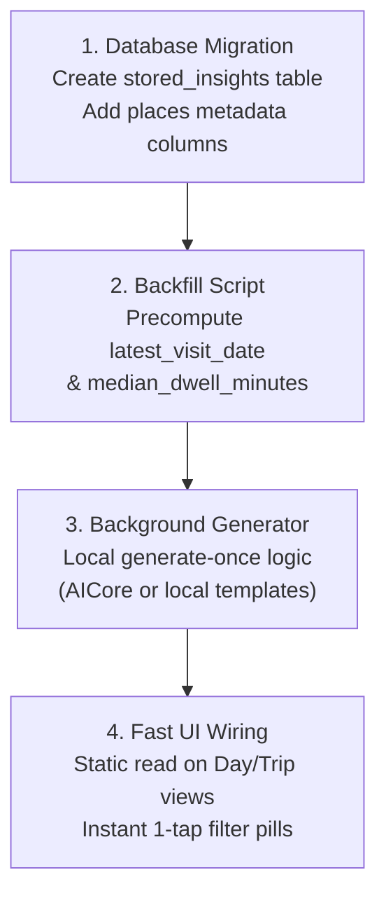

# Specification: On-Device Location Intelligence, Stored Insights, and Frictionless Search

---

## 1. Principles & Architectural Invariants

1. **Zero Data Egress (Strict Privacy Boundary):** Location telemetry, visit logs, and POI records must never leave the local device boundary (`odlh-storage.db`). All computation, summarization, and query execution occur locally on-device. Zero cloud API calls.
2. **Generate-Once, Read-Forever (Stored Insights):** Narrative summaries, trip chronicles, and habit milestones are computed once during background idle/charging maintenance windows and written directly into local SQLite tables. User-facing view loads are static, instantaneous reads ($< 1\text{ ms}$).
3. **Frictionless Interaction (Zero Query-Engineering):** Users do not compose multi-clause natural language prompts. Search relies on short keywords, immediate auto-complete, and one-tap tactile filter pills.

---

## 2. Frictionless Place Search & Tap-First Filters

### 2.1. Search Mechanism (No Complex Prompting)
Real-world timeline search consists of typing 1–2 words (e.g. *"tacos"*, *"Blue Bottle"*, *"Zurich"*). Search executes as a direct, indexed prefix/substring match against the local `places` catalog:

```sql
SELECT place_id, name, address, category, city, visit_count, latest_visit_date, median_dwell_minutes
FROM places
WHERE (name LIKE :kw OR category LIKE :kw OR city LIKE :kw)
ORDER BY visit_count DESC
LIMIT 30;
```
* **Performance:** Executes in $< 1.5\text{ ms}$ over 15,000+ local places using existing SQLite B-trees.
* **Zero Overhead:** No vector embeddings, no embedding drift, no external model calls.

### 2.2. The 4 One-Tap Contextual Filters
Users navigate their personal catalog via four persistent, one-tap filter rows positioned directly above the place list:

```
┌────────────────────────────────────────────────────────────────────────────────────────┐
│  CITY:     [All] [★ New York (3.2k)] [Zurich (1.1k)] [San Francisco (420)] [More...]   │
│  CADENCE:  [All] [★ Haunts (5+)] [🌙 Dormant (>1y)] [✨ One-Offs]                       │
│  DWELL:    [All] [☕ Quick (<30m)] [💻 Deep (>1h)]                                      │
│  CATEGORY: [All] [Food & Drink] [Coffee] [Outdoors & Culture] [Transit]                │
└────────────────────────────────────────────────────────────────────────────────────────┘
```

#### Dynamic Criteria:
* **City:** Dynamically populated from `SELECT city, count(*) FROM places GROUP BY city ORDER BY count(*) DESC LIMIT 5`.
* **Cadence:**
  * `★ Haunts`: Places with $\ge 5$ lifetime visits.
  * `🌙 Dormant`: Places with $\ge 3$ visits, but zero visits in $> 365\text{ days}$ (rediscovery engine).
  * `✨ One-Offs`: Places visited exactly once (travel exploration).
* **Dwell:**
  * `Quick Stop`: `median_dwell_minutes <= 30` (coffee pick-ups, bakeries, errands).
  * `Deep Dwell`: `median_dwell_minutes >= 60` (working cafes, long dinners, museums).
* **Category:** Normalized high-level taxonomy.

---

## 3. Stored Insights Engine (Generate-Once Architecture)

```
             ┌────────────────────────────────────────────────────────┐
             │       Trigger: Device Idle + Connected to Power        │
             │       (Android WorkManager / Nightly Maintenance)       │
             └───────────────────────────┬────────────────────────────┘
                                         │
                                         ▼
             ┌────────────────────────────────────────────────────────┐
             │ 3.1 Detector: Identify Unsummarized Entities           │
             │ - Closed Day (T - 1 day)                               │
             │ - Settled Multi-Day Trip (Trip boundary finalized)     │
             │ - Milestone Reached (e.g. 10th visit to a place)       │
             └───────────────────────────┬────────────────────────────┘
                                         │
                                         ▼
             ┌────────────────────────────────────────────────────────┐
             │ 3.2 Local On-Device Inference                          │
             │ - Android AICore / Gemini Nano (Local on-device)        │
             │ - Deterministic Rule Template (Fallback)               │
             │ - ZERO BYTES SENT OVER NETWORK                         │
             └───────────────────────────┬────────────────────────────┘
                                         │
                                         ▼
             ┌────────────────────────────────────────────────────────┐
             │ 3.3 Persistence: Write to SQLite                       │
             │ INSERT INTO stored_insights (type, key, text, stats)   │
             └───────────────────────────┬────────────────────────────┘
                                         │
                                         ▼
             ┌────────────────────────────────────────────────────────┐
             │ 3.4 Runtime User View                                  │
             │ SELECT narrative FROM stored_insights WHERE key = ?    │
             │ Instantaneous Render (< 0.5 ms)                        │
             └────────────────────────────────────────────────────────┘
```

### 3.1. Local Database Schema

All precomputed insights reside in a single, lightweight SQLite table:

```sql
CREATE TABLE stored_insights (
    insight_id TEXT PRIMARY KEY,          -- e.g. 'day_2024-10-05', 'trip_tokyo_2019'
    insight_type TEXT NOT NULL,           -- 'DAY_DIGEST', 'TRIP_CHRONICLE', 'MILESTONE'
    entity_key TEXT NOT NULL,             -- Date '2024-10-05' or trip UUID
    title TEXT NOT NULL,                  -- Short header
    narrative TEXT NOT NULL,              -- 1-2 paragraph precomputed summary
    stat_summary TEXT,                    -- JSON metrics: {"km": 12.4, "top_mode": "WALK", "places": 3}
    generated_at_utc TIMESTAMP NOT NULL
);

CREATE INDEX idx_stored_insights_lookup ON stored_insights(insight_type, entity_key);
```

### 3.2. Stored Insight Artifacts

#### A. Daily Micro-Digest (Generated Nightly)
* **Trigger:** Daily at 03:00 local time for the preceding day.
* **On-Device Input Context:** Compact 400-byte string of the day's settled segments:
  ```
  Date: 2024-10-05, City: New York
  Distance: 7.8 km (Walking: 4.2km, Citi Bike: 3.6km)
  Visits: Ground Support Cafe (1h 45m), SoHo Office (4h 10m), Buvette (1h 30m)
  ```
* **Stored Result:**
  > *"Active Saturday in SoHo: 7.8 km split between bike transit and walking. Anchored by a morning working session at Ground Support Cafe and an evening dinner at Buvette."*
* **Runtime Read:** When viewing the Day Timeline, the card header displays the stored `narrative` directly.

#### B. Trip Chronicles (Generated on Trip Settlement)
* **Trigger:** Once, when a multi-day trip is completed (user returns to home territory).
* **On-Device Input Context:** Aggregate visit list, total distance, cities, and top visited places for the trip interval.
* **Stored Result:**
  > **Autumn Journey Through Tokyo & Kyoto (Oct 12–24, 2019)**
  > 
  > *A 12-day journey spanning Tokyo and the Kansai region, characterized by high pedestrian mobility averaging 16.4 km per day. The initial four days were anchored in Shinjuku, featuring morning walks through Meiji Jingu and late-night food exploration in Omoide Yokocho. On October 16, a Tokaido Shinkansen transition connected to Kyoto.*
  > 
  > *The Kansai leg shifted to bicycle transit along the Kamo River. Key working sessions were logged at % Arabica Higashiyama and Fuglen Tokyo. Cultural dwells centered on temple precincts in eastern Kyoto, concluding with a rapid rail return to Haneda on October 24.*
* **Runtime Read:** Opening the Trips tab fetches the stored markdown in $< 0.5\text{ ms}$.

#### C. Personal Milestones (Generated on Visit Finalization)
* **Trigger:** When a visit increments a place counter past a milestone threshold ($5, 10, 25, 50, 100$).
* **Stored Result:** Stored as place card tags:
  * *"10th visit to Ground Support Cafe (First visited Oct 2018)"*
  * *"Dormant Favorite: You haven't visited Buvette in 410 days (24 total visits)"*

---

## 4. Hardware Resource, Storage & Performance Budget

### 4.1. Storage Footprint (Lifelong Dataset: 15,000 Places, 20 Years)

| Data Structure | Sizing Formula | 10-Year Footprint | 20-Year Footprint |
| :--- | :--- | :---: | :---: |
| **Daily Digests** | $365\text{ entries/year} \times 120\text{ bytes}$ | $438\text{ KB}$ | **$876\text{ KB}$** |
| **Trip Chronicles** | $\sim 10\text{ trips/year} \times 600\text{ bytes}$ | $60\text{ KB}$ | **$120\text{ KB}$** |
| **Places Columns** | $15,000\text{ places} \times 8\text{ bytes}$ (`latest_date`, `dwell`) | $120\text{ KB}$ | **$120\text{ KB}$** |
| **SQLite Index** | B-Tree index on `(type, entity_key)` | $85\text{ KB}$ | **$170\text{ KB}$** |
| **Total Stored Overhead** | Fully materialized SQLite database entries | **$\approx 703\text{ KB}$** | **$\approx 1.28\text{ MB}$** |

*The entire intelligence dataset across 20 years occupies less than a single high-resolution smartphone photograph.*

### 4.2. Runtime Performance SLAs

| Operational Phase | Execution Environment | Latency (p99) | Network Egress | Battery Impact |
| :--- | :--- | :---: | :---: | :---: |
| **Place Keyword Search** | Local SQLite B-Tree scan | **$< 2.0\text{ ms}$** | **$0\text{ bytes}$** | None ($<0.001\%$) |
| **Filter Pill Toggle** | Local covering index lookup | **$< 1.5\text{ ms}$** | **$0\text{ bytes}$** | None ($<0.001\%$) |
| **Day Header Digest Load** | Single row read from `stored_insights` | **$< 0.4\text{ ms}$** | **$0\text{ bytes}$** | None (Static read) |
| **Trip Narrative Load** | Single row read from `stored_insights` | **$< 0.5\text{ ms}$** | **$0\text{ bytes}$** | None (Static read) |
| **Nightly Insight Generation** | On-device AICore / Gemini Nano (charging) | $\sim 1.2\text{ s}$ / day | **$0\text{ bytes}$** | Gated to plugged-in state |

---

## 5. UI Surface Specification

### 5.1. Day View Header (Stored Micro-Digest)
```
┌────────────────────────────────────────────────────────────────────────────────────────┐
│ 📅 Saturday, October 5, 2024                                   [NYC] [7.8 km · Walk]   │
│                                                                                        │
│ 💬 "Active Saturday in SoHo: 7.8 km split between bike transit and walking. Anchored   │
│     by a morning working session at Ground Support Cafe and dinner at Buvette."        │
└────────────────────────────────────────────────────────────────────────────────────────┘
```

### 5.2. Places View (Search + One-Tap Filters)
```
┌────────────────────────────────────────────────────────────────────────────────────────┐
│  🔍 Search places or cities...                                                    [✕]  │
├────────────────────────────────────────────────────────────────────────────────────────┤
│  CITY:     [All] [★ New York (3.2k)] [Zurich (1.1k)] [Tokyo (410)]                     │
│  CADENCE:  [All] [★ Haunts (5+)] [🌙 Dormant (>1y)] [✨ One-Offs]                       │
│  DWELL:    [All] [☕ Quick (<30m)] [💻 Deep (>1h)]                                      │
├────────────────────────────────────────────────────────────────────────────────────────┤
│  MATCHED PLACES (42):                                                                  │
│  ┌──────────────────────────────────────────────────────────────────────────────────┐  │
│  │ ☕ Ground Support Cafe · 399 West Broadway, NYC             [48 Visits · 94.2h]   │  │
│  │ ★ Regular Haunt · Typical dwell: 1h 45m · Last visit: 3 days ago                │  │
│  ├──────────────────────────────────────────────────────────────────────────────────┤  │
│  │ 🍽️ Buvette · 42 Grove St, NYC                                [24 Visits · 38.0h]   │  │
│  │ 🌙 Dormant Favorite · No visits in 410 days · Last visit: Aug 2023               │  │
│  └──────────────────────────────────────────────────────────────────────────────────┘  │
└────────────────────────────────────────────────────────────────────────────────────────┘
```

### 5.3. Trip Story Card (Stored Trip Chronicle)
```
┌────────────────────────────────────────────────────────────────────────────────────────┐
│ ✈️ Tokyo & Kyoto Autumn Journey                              Oct 12 – 24, 2019 (12 days)│
│                                                                                        │
│ A 12-day journey spanning Tokyo and the Kansai region, characterized by high           │
│ pedestrian mobility averaging 16.4 km per day. The initial four days were anchored in  │
│ Shinjuku, featuring morning walks through Meiji Jingu and late-night food exploration  │
│ in Omoide Yokocho. On October 16, a Tokaido Shinkansen transition connected to Kyoto.   │
│                                                                                        │
│ [Highlight Stops: Meiji Jingu · Fuglen Tokyo · % Arabica Kyoto · Fushimi Inari]        │
└────────────────────────────────────────────────────────────────────────────────────────┘
```

---

## 6. Implementation Plan



1. **Step 1 (Schema):** Create `stored_insights` table; add `latest_visit_date` and `median_dwell_minutes` to `places`.
2. **Step 2 (Backfill):** Execute single deterministic SQL backfill script over existing `segments` table.
3. **Step 3 (Generator):** Implement the on-device generation pass: compile closed days and finished trips into narrative strings, writing to `stored_insights`.
4. **Step 4 (UI Integration):** Wire the 4 filter rows in `static/index.html` and connect Day/Trip header views to read directly from `stored_insights`.
